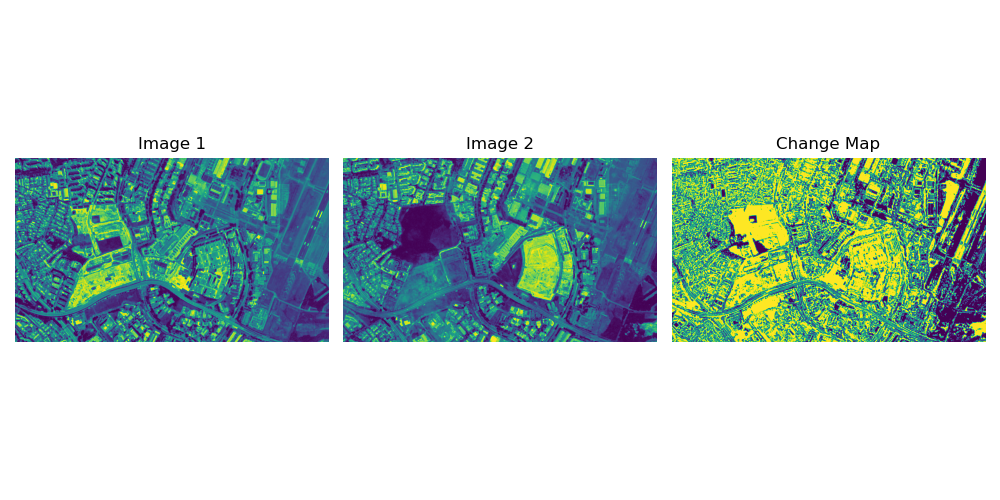
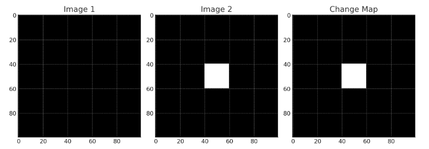

# 🌍 Change Detection in Raster Images 
(work in progress)

## 📝 Overview
This project is a simple implementation of change detection for raster imagery using Python. It utilizes **rasterio** to read and write GeoTIFF files, enabling efficient geospatial data processing. The solution computes pixel-wise differences between two input images and generates a binary change map 🗺️. 
<div align="center">
  </img>
</div>
## 🎯 Purpose
Mapsheet refreshes are usually excessively tedious, change detection helps to narrow down the scope that cartographers need to review instead of manually performing analysis. This solution also has general uses in IMINT analysis/ HADR Damage Assessment.

<div align="center">
  </img>
</div>

### ❓ What is Rasterio?
[Rasterio](https://rasterio.readthedocs.io/) is a Python library that enables reading, writing, and processing geospatial raster datasets. It provides an easy-to-use API to handle raster formats like GeoTIFF while maintaining geospatial metadata and ensuring efficient I/O operations.

## 📄 Methodology

### **1️⃣ Read and Process Raster Images**
The code extracts only **the first band** (assumes single-band grayscale images). 

### **2️⃣ Image Alignment**
- If the two images have different dimensions, it **resizes the second image** to match the first one.  
- This ensures pixel-wise comparison.  

### **3️⃣ Compute Change Detection**
- The script calculates the **absolute difference** between the two images to highlight changed areas while ignoring sign differences.
- **Normalization**: Scales `diff_image` values between `0-255` for consistency.  
- **Logarithmic Transformation**: log(1 + diff_image)
- **Thresholding**:  Computes a **dynamic threshold** (`threshold = 0.5 * max(diff)`) and sets pixels **above threshold to 255 (white) and below to 0 (black)**.  

## 🚀 How to Run It

### 🛠️ Install Required Libraries
Ensure you have Python installed along with the following libraries:

- **rasterio** 🗺️
- **numpy** 🔢
- **matplotlib** 📊

Install them:
```
pip install rasterio numpy matplotlib
```

### ▶️ Run the python script
Execute it in your terminal or command prompt
```
python mapmole.py
```
📂 Input the file paths accordingly

### 📤 Output

The script will generate an output GeoTIFF file (e.g., output_change_map.tif) containing the binary change map.
It will also display visualizations of the input images and the resulting change map.
(In the event that too many or too few changes are being detected in the output map, adjust the threshold parameter in the script.)

💡 Pro Tip: Try this solution for deforestation monitoring 🌳, urban expansion tracking 🏙️, or disaster impact assessment 🌊


