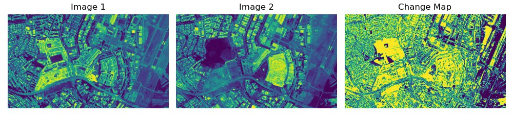
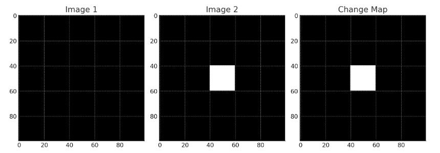

# 🐀 MapMole

**Raster change detection made easy** — upload two GeoTIFF satellite images and instantly see what changed.

<div align="center">
  
</div>

## Overview

MapMole compares two raster images (GeoTIFF) and produces a binary change map highlighting areas of difference. It ships with both a **Streamlit web UI** and a **command-line interface**, so you can use whichever fits your workflow.

### Use Cases

| Domain | Example |
|--------|---------|
| **HADR** | Assess damage after natural disasters by comparing pre- and post-event satellite imagery |
| **IMINT** | Monitor activity patterns, infrastructure, and developments over time |
| **Cartography** | Detect deforestation, urban expansion, or shifting coastlines for mapsheet refreshes |

<div align="center">
  
</div>

## How It Works

1. **Read** - extract the first band and its CRS, transform and validity mask. Both images must have a CRS.
2. **Align** - reproject the second image onto the first image's geographic grid with bilinear interpolation, even when their dimensions match.
3. **Compare** - calculate absolute differences only where both images contain finite, valid data. Disjoint images fail with an actionable error; uncovered pixels are never counted as unchanged.
4. **Enhance** - scale differences from zero, apply a log stretch, then threshold into a 0/255 map. Relative differences at or below `1e-12` are treated as floating-point roundoff. Uniform positive differences remain detectable.
5. **Export** - retain the first image's CRS and transform and embed the validity mask inside the GeoTIFF. Zero means unchanged; masked pixels mean not compared.

The percentage shown in the UI uses **valid overlapping pixels** as its denominator.
This is spectral change detection, not land-use classification: use comparable bands
and radiometric units. Clouds, seasonal changes and registration errors can all
produce differences. Bilinear interpolation is intended for continuous imagery,
not categorical land-cover rasters.

## Sample pair and deployment

The app opens with a sample pair switched on, so it works without uploading anything:
`samples/tuas_2018-01-21_nir.tif` and `samples/tuas_2025-12-05_nir.tif` are the same 6.6 × 6.6 km
window over Tuas, Singapore, in Sentinel-2's near-infrared band (10 m). The new Tuas container port's
reclaimed piers show up as change (a visible portion of the comparison area); two small clouds in
the 2025 scene add a little noise. Switch the sample off to upload your own pair.

Contains modified Copernicus Sentinel data (2018, 2025), via Element 84's Earth Search catalogue on AWS.

**Deploy on Streamlit Community Cloud (free):** at share.streamlit.io choose **Create app**, pick this
repository, branch `main` and main file `app.py`, and (under Advanced settings) Python 3.12. It installs
`requirements.txt`. Then set the repository's website link to the new app URL.

## Quick Start

### Prerequisites

- Python 3.9+

### Install

```bash
pip install -r requirements.txt
```

### Web UI (recommended)

```bash
streamlit run app.py
```

This opens an interactive dashboard where you can:
- Upload two `.tif` images
- Adjust the change-detection threshold with a slider
- Choose a colour map
- View side-by-side results with statistics
- Download the output change map

### CLI

```bash
# Interactive prompts
python mapmole.py

# Or pass arguments directly
python mapmole.py --image1 before.tif --image2 after.tif --output changes.tif --threshold 0.7
```

## Project Structure

```
mapmole/
├── app.py              # Streamlit web UI
├── core.py             # Shared change-detection engine
├── mapmole.py          # Command-line interface
├── requirements.txt    # Python dependencies
├── .gitignore
├── LICENSE             # MIT
└── readme/             # Images for this README
```

---

## CLI Reference

The CLI supports both **interactive mode** (guided prompts) and **argument mode** for scripting and automation.

### Interactive Mode

```bash
python mapmole.py
```

You'll be prompted to enter:
1. Path to the first `.tif` image
2. Path to the second `.tif` image
3. Path for the output `.tif` file

A matplotlib window will display the before, after, and change map side by side.

### Argument Mode

```bash
python mapmole.py --image1 <path> --image2 <path> --output <path> [--threshold <float>]
```

| Flag | Required | Default | Description |
|------|----------|---------|-------------|
| `--image1` | Yes* | — | Path to the first (before) `.tif` image |
| `--image2` | Yes* | — | Path to the second (after) `.tif` image |
| `--output` | Yes* | — | Path for the output change map `.tif` |
| `--no-show` | No | off | Export without opening a plot |
| `--threshold` | No | `0.75` | Sensitivity factor (0.0–1.0). Lower = more changes detected |

*If omitted, the CLI falls back to interactive prompts.

### Examples

```bash
# Full argument mode — no prompts
python mapmole.py --image1 before.tif --image2 after.tif --output changes.tif

# High sensitivity (detect subtle changes)
python mapmole.py --image1 before.tif --image2 after.tif --output changes.tif --threshold 0.5

# Low sensitivity (only major changes)
python mapmole.py --image1 before.tif --image2 after.tif --output changes.tif --threshold 0.9

# Mixed — supply images via args, get prompted for output path
python mapmole.py --image1 before.tif --image2 after.tif
```

## License

[MIT](LICENSE) — made by [kevanwee](https://github.com/kevanwee).


## Validation

```bash
pip install -r requirements-dev.txt
python -m pytest -q
python mapmole.py --image1 samples/tuas_2018-01-21_nir.tif --image2 samples/tuas_2025-12-05_nir.tif --output changes.tif --no-show
```

CI covers geographic alignment, reprojection, missing CRS, disjoint coverage,
nodata interpolation, internal export masks, constant differences and the bundled example.
