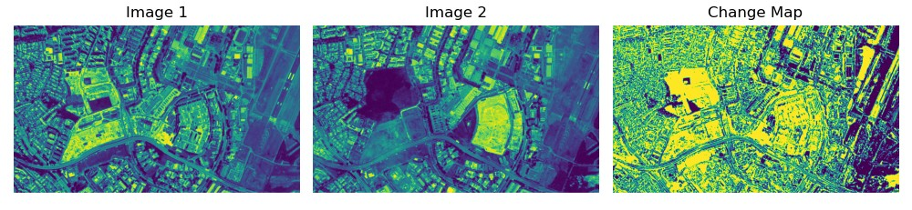

# 🌍 Change Detection in Raster Images 
(work in progress)
<div align="center">
  </img>
</div>

## 📝 Overview
This project is a simple implementation of change detection for raster imagery using Python. It utilizes **rasterio** to read and write GeoTIFF files, enabling efficient geospatial data processing. The solution computes pixel-wise differences between two input images and generates a binary change map 🗺️. 

## 🎯 Purpose
Change detection is a critical technique used across various domains to identify and analyze differences in spatial, structural, or environmental data over time with uses in:
- Humanitarian Assistance and Disaster Relief (HADR): assessing damage after natural disasters by comparing pre- and post-event satellite imagery;
- Imagery Intelligence (IMINT) analysis: monitor activity patterns, and infrastructure developments; and
- Cartography: detect landscape changes such as new urban developments, deforestation, or shifting coastlines to assist in mapsheet refreshes.

<div align="center">
  </img>
</div>

### ❓ What is Rasterio?
[Rasterio](https://rasterio.readthedocs.io/) is a Python library that enables reading, writing, and processing geospatial raster datasets. It provides an easy-to-use API to handle raster formats like GeoTIFF while maintaining geospatial metadata and ensuring efficient I/O operations.

## 📄 Methodology

### **1️⃣ Read and Process Raster Images**
The code extracts only **the first band** (assumes single-band grayscale images). 
(Note: it is recommended to use images that have the same projection system)

### **2️⃣ Image Alignment**
- If the two images have different dimensions, it **resizes the second image** to match the first one.  
- This ensures pixel-wise comparison.  

### **3️⃣ Compute Change Detection**
- The script calculates the **absolute difference** between the two images to highlight changed areas while ignoring sign differences.
- **Normalization**: Scales `diff_image` values between `0-255` for consistency.  
- **Logarithmic Transformation**: log(1 + diff_image)
- **Thresholding**:  Computes a **dynamic threshold** (`threshold = 0.5 * max(diff)`) and sets pixels **above threshold to 255 (white) and below to 0 (black)**.  

## 🚀 How to Run It

### 🛠️ Install Required Libraries
Ensure you have Python installed along with the following libraries:

- **rasterio** 🗺️
- **numpy** 🔢
- **matplotlib** 📊

Install them:
```
pip install rasterio numpy matplotlib
```

### ▶️ Run the python script
Execute it in your terminal or command prompt
```
python mapmole.py
```
📂 Input the file paths accordingly

### 📤 Output

The script will generate an output GeoTIFF file (e.g., output_change_map.tif) containing the binary change map.
It will also display visualizations of the input images and the resulting change map.
(In the event that too many or too few changes are being detected in the output map, adjust the threshold parameter in the script.)

💡 Pro Tip: Try this solution for deforestation monitoring 🌳, urban expansion tracking 🏙️, or disaster impact assessment 🌊

💡 Pro Tip 2: Color correcting the imagery would generally be helpful. Note that results may vary based on the cloud cover and errors in georectification.


